# 用AI創造自己的工作流

## 你應該用AI建立自己的工作流

因為只有你最知道你自己的需求

## 舉例
我的痛點
* 想要都使用md檔
  * 可以整包zip給AI去做文字處理、很好批量處理
  * 其他筆記網站不好在不同地方sync  
  * 不用被平台綁架，可以用不同軟體開啟 - foam vs obsidian  

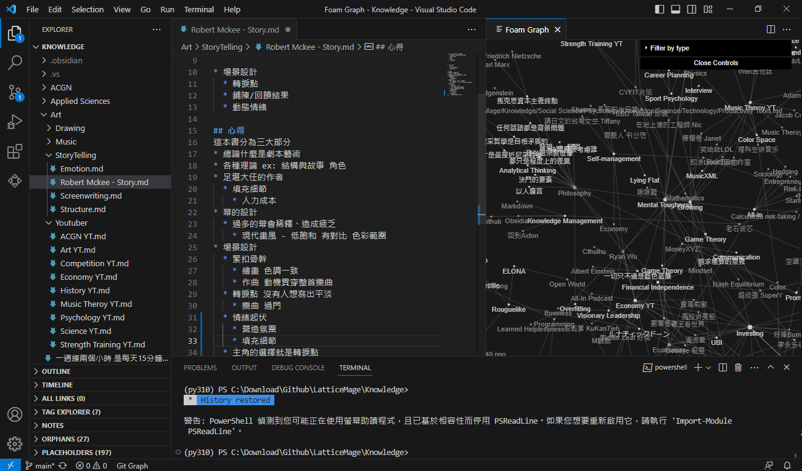vs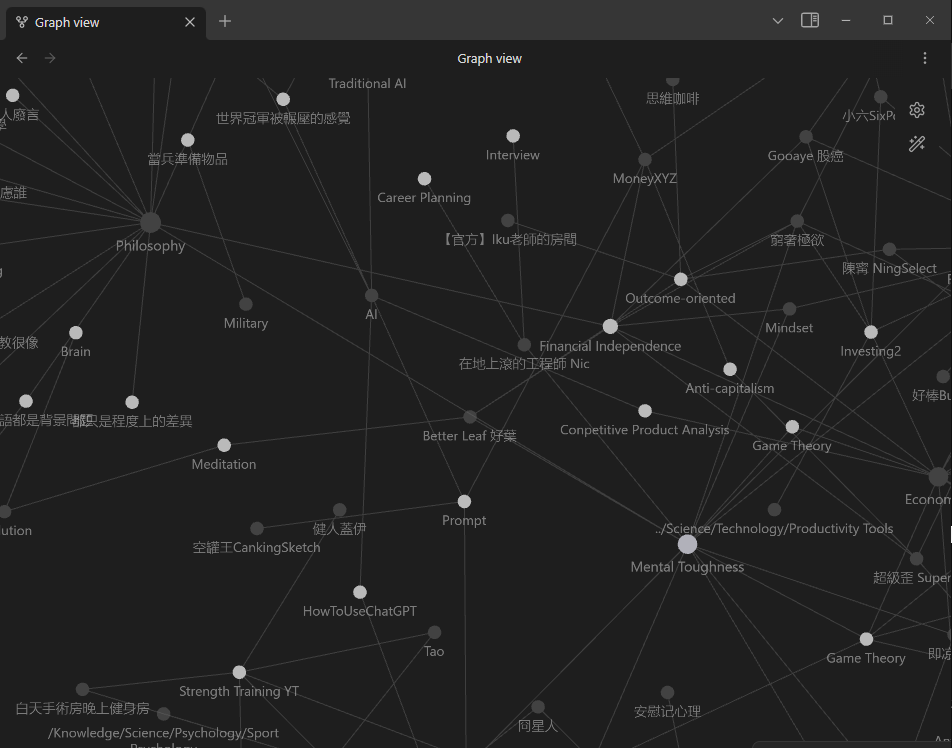  

## 不用被綁架
ex: hackmd網站更新無法使用舊版功能  
ex: discord是私人群組，而且內容不好備份  
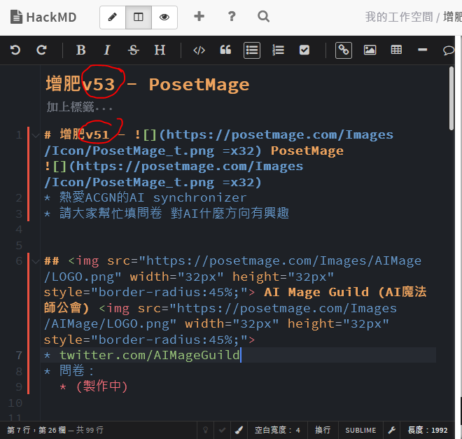or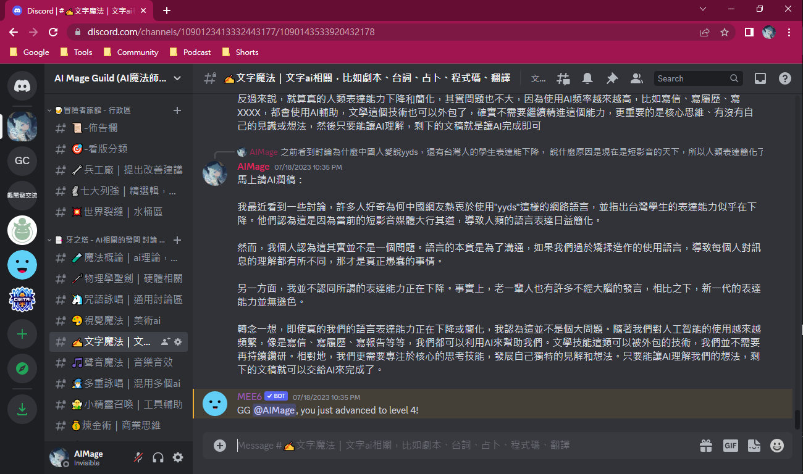  

## 架成資料網站
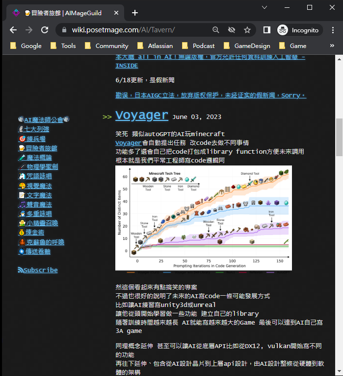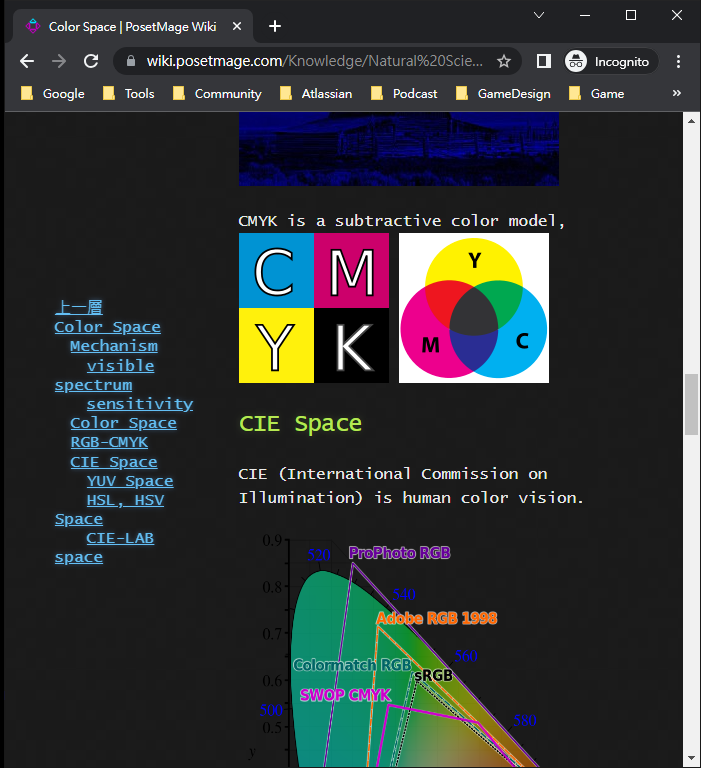  
[網站](/) [原始碼](https://github.com/LatticeMage/LatticeMage.github.io)

## 部落格、小說 
以前寫在blogger.com，搬回個人網站也利於個人品牌經營管理
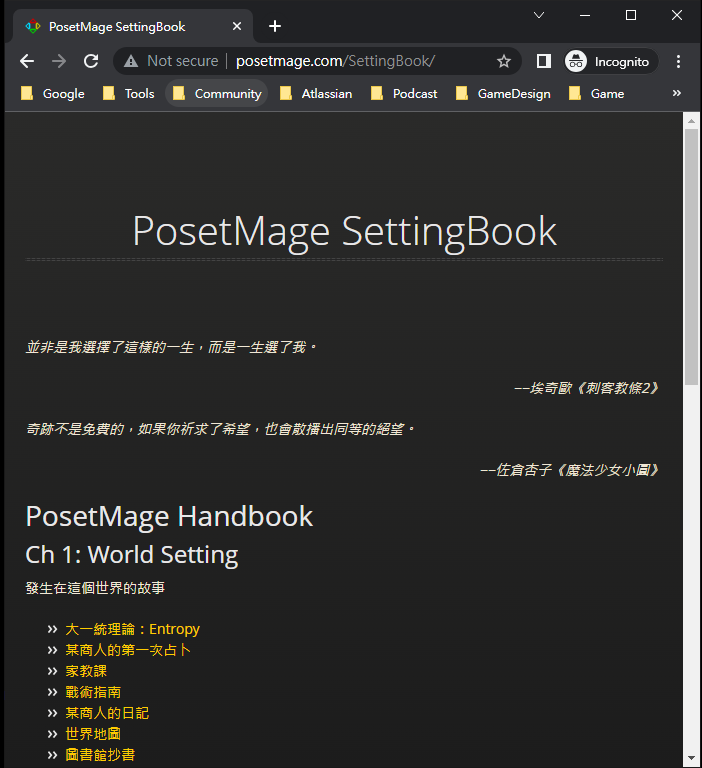 
[網站](https://posetmage.com/Blog/) [原始碼](https://github.com/posetmage/posetmage.github.io)
[網站](https://posetmage.com/SettingBook/) [原始碼](https://github.com/posetmage/SettingBook)

## 遊戲發想提案
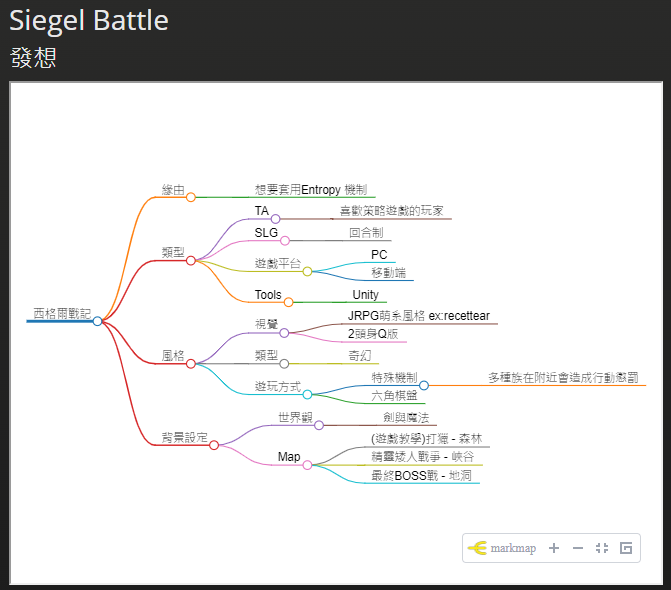  
[網站](https://posetmage.com/Portfolio/Siegel%20Battle/design/) [原始碼](https://github.com/posetmage/Portfolio/tree/master/Siegel%20Battle/design)

## 遊戲角色卡
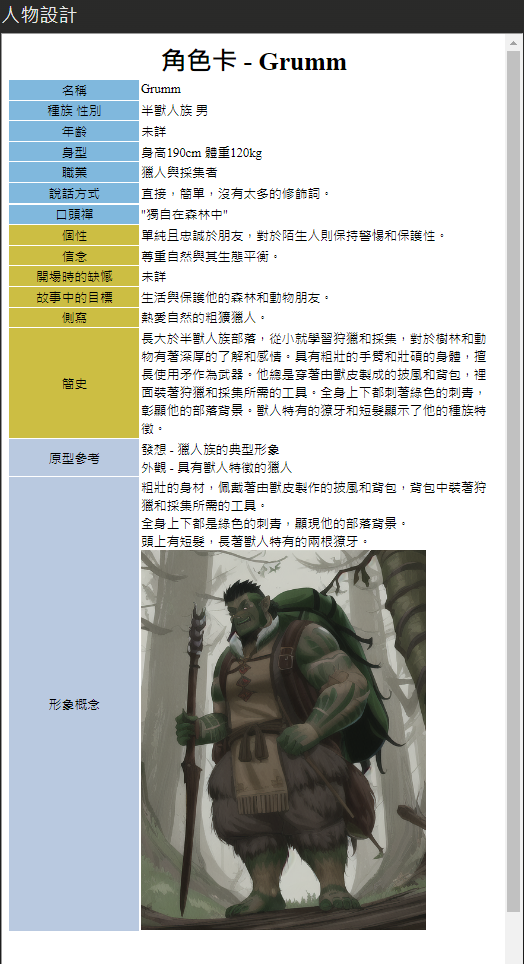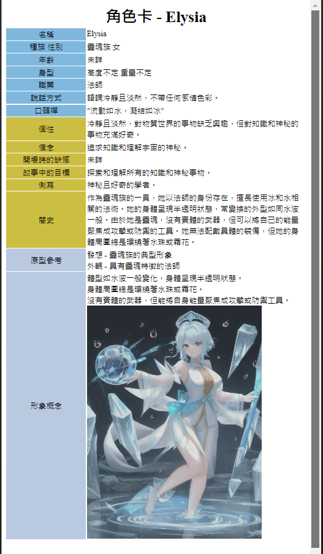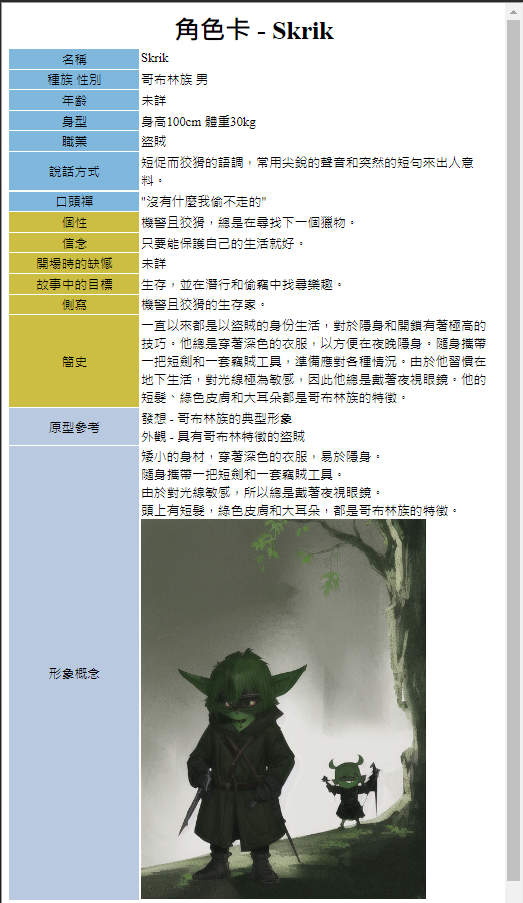  
[網站](https://posetmage.com/Portfolio/StM4H4/05/First/) [原始碼](https://github.com/posetmage/Portfolio/tree/master/StM4H4/05/First)

## 遊戲劇本圖文
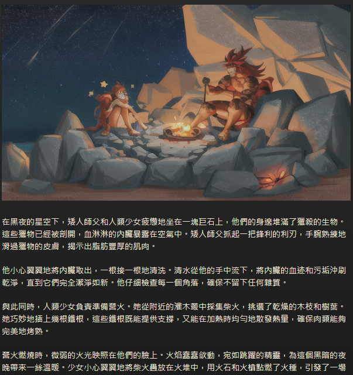  
[網站](https://posetmage.com/Portfolio/Siegel%20Battle/Dialog.html) [原始碼](https://github.com/posetmage/Portfolio/tree/master/Siegel%20Battle/Dialog)

## 輔助打牌下棋分析

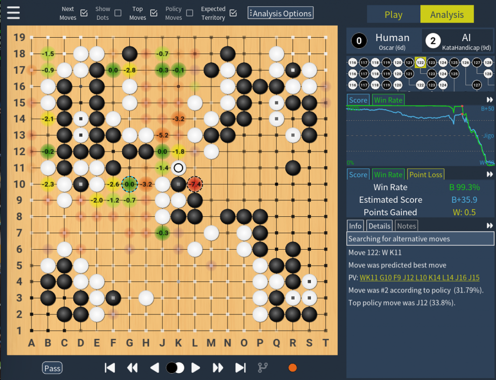

katago圖片來自[katago专用对弈分析软件katrain – 天祺围棋](https://www.tianqiweiqi.com/katago-katrain.html)

## 視覺化分析
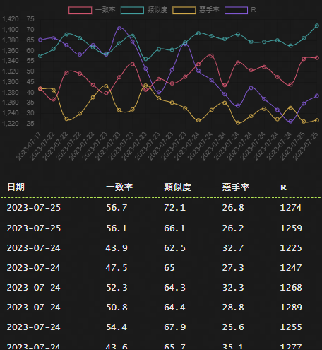  
[網站](/AI/Cthulhu/NAGA) [原始碼](https://raw.githubusercontent.com/LatticeMage/AI/master/Cthulhu/NAGA.md)

## 上字幕
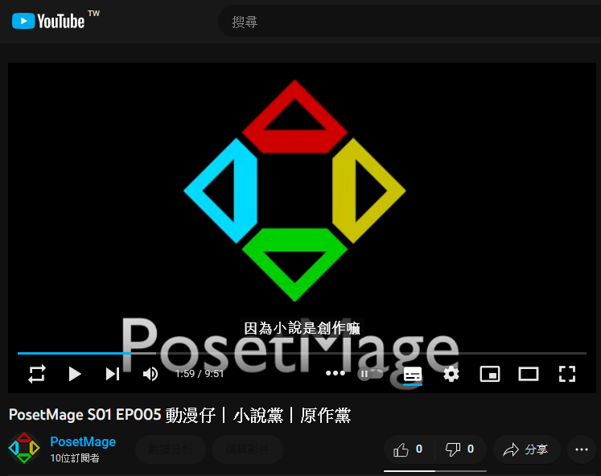  
[原始碼](https://github.com/LatticeMage/Tools/tree/main/Subtitle)

## 系統工具
ex: 預設進入conda、右鍵各種開啟  
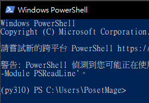 and 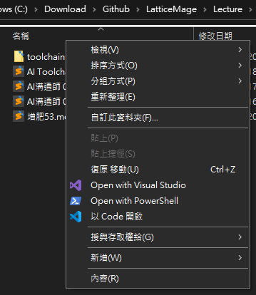  
[原始碼](https://github.com/LatticeMage/Tools/tree/main/Windows)

## 汙染社群媒體
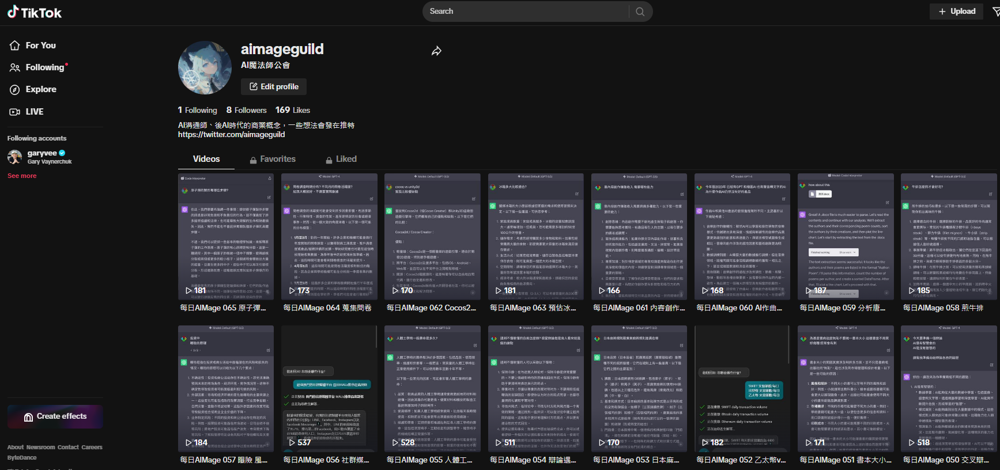  
[網站](https://www.tiktok.com/@aimageguild)

## 自架問卷系統
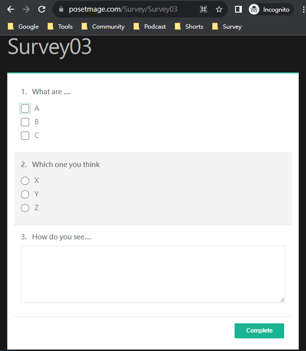  
[範例網站](https://posetmage.com/Survey/Survey03)  
[原始碼](https://github.com/posetmage/Survey)

