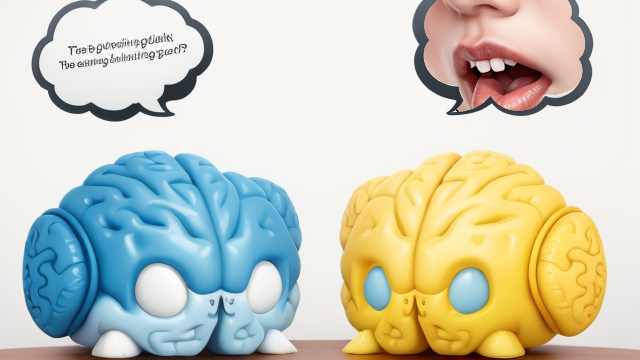

# 為什麼學AI很難

## 為什麼學AI很難
  
正詠詞:a wizard using computer

## 難點：找到方向
<table>
<tr>
<td></td>
<td>要先找到想解決的問題或挑戰</td>
</tr>
</table>
正詠詞: a complex labyrinth maze

## 難點：第二階段知識
<table>
<tr>
<td></td>
<td>第二階段知識是你可以靈活運用的第一階段知識</td>
</tr>
</table>
正詠詞: two brain, one brain having text, another brain thinking oral talking  
反詠詞增加: human, women,  

### Reference
<iframe width="450" height="255" src="https://www.youtube.com/embed/jRjBUbxQ0O0" title="YouTube video player" frameborder="0" ></iframe>

## 難點：跨領域整合
<table>
<tr>
<td></td>
<td>AI是一種第二階段知識，加上原本的領域第二階段，需要跨領域的整合</td>
</tr>
</table>
正詠詞: juggler, multi-arms, 6 arms, playing guitar, playing ball, playing violin, playing piano, playing drum

## 推薦影片
[ChatGPT给的机会, 你能抓住吗?](https://www.youtube.com/watch?v=KoT08Kno10A)  
<iframe width="450" height="255" src="https://www.youtube.com/embed/KoT08Kno10A" title="YouTube video player" frameborder="0" ></iframe>

## 作業一
<table>
<tr>
<td></td>
<td>使用AI生產做一件事，可能是寫小說、寫程式、畫圖、...... 基於這個第一版產出，你去尋找某個領域的知識，想想怎麼結合與改進
</td>
</tr>
</table>
正詠詞: using magic

## 作業二
<table>
<tr>
<td></td>
<td>找到一個可以持續改進、持續生產的循環 
ex: AI寫小劇本，然後去看劇本知識，比如幕的規劃，再請AI幫忙規劃幕之間的關係、...... 
ex: 跟AI學hello world，然後請AI教更多的程式概念比如變數迴圈，再請AI寫變數迴圈的demo code、......
</td>
</tr>
</table>
正詠詞: research magic

## 詠唱詞

* Stable Diffusion 基本設定
  * revAnimated
  * 反詠詞： lowres, text, error, missing fingers, extra digit, fewer digits, cropped, worst quality, low quality, normal quality, jpeg artifacts,signature, watermark, username, blurry, artist name,
* [ChatGPT詠唱過程](./Slides/HardToLearn/chat.html)

