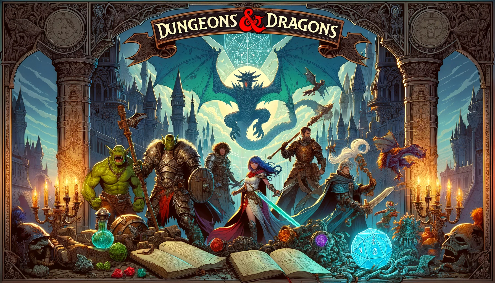
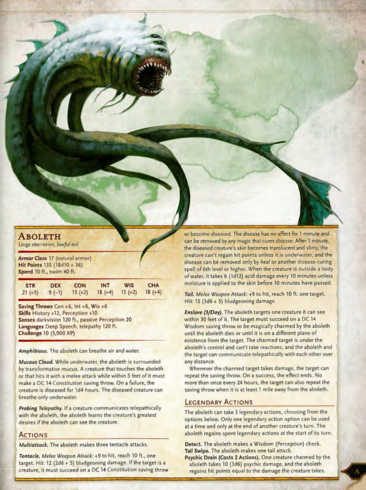
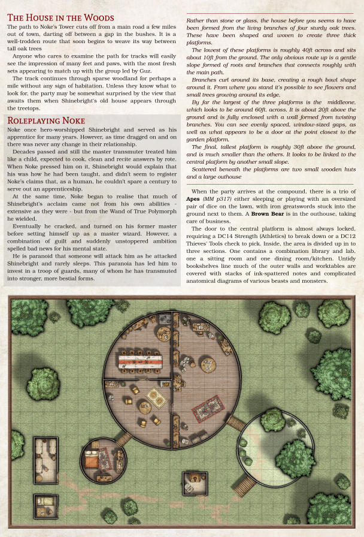
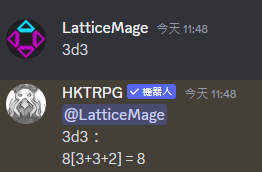
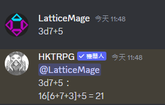

# DnD 遊戲設計

# 手冊

### reference:
* https://github.com/kwmorris/DnD/

# 骰子

# 遊戲劇本注意事項
* 遊戲時長要先規定好
* 數值為主，劇情為輔，遊玩過程是由玩家跟城主去或的劇情
* 

## 協作工具
Github

## 地圖工具
https://opengameart.org/

## 文字編輯軟體
Obisidian, Hackmd.io .... 

