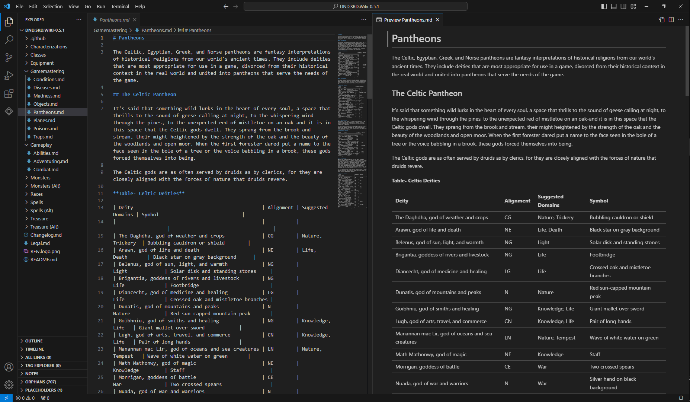
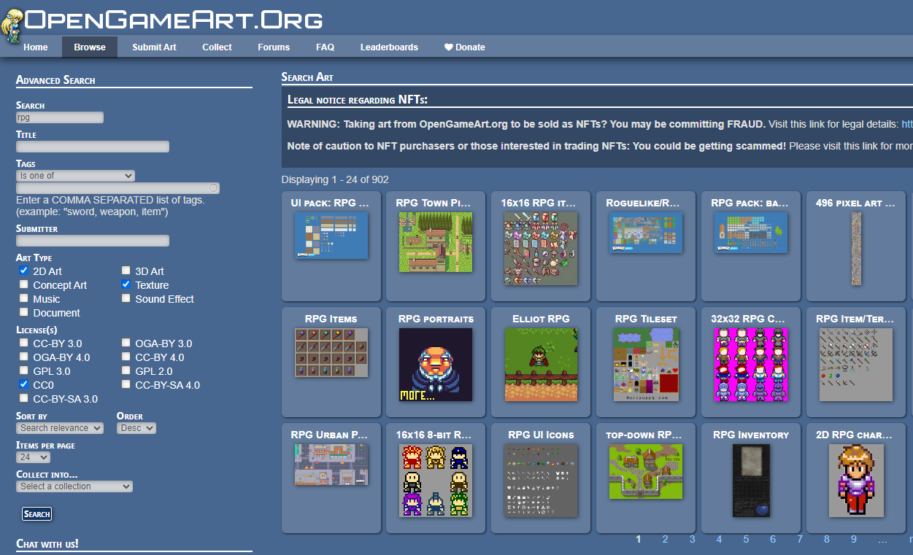

# DnD 遊戲設計

## 手冊

* 舉例
  * 柏德之門、冰風之谷、絕冬城之夜 使用金盒子的被遺忘國度

### reference:
* https://github.com/kwmorris/DnD/

## 骰子

* xdy
  * 
  * 
* d20 
  * 20 完全成功
  * 1 完全失敗
  * 事件門檻

## 數值卡

角色、怪物、商店 皆要固定版面

* 參考版面
  * https://github.com/OldManUmby/DND.SRD.Wiki/blob/master/Monsters/
* ex: [shop](https://github.com/kwmorris/DnD/blob/master/5e/D%26D%20Shop%20Catalog%2C%20V-1.8.pdf)

## 遊戲劇本注意事項

* 遊戲時長要先規定好
  * 遊戲進程規劃以節點為主
    * ex: 一個節點30min，分為探索20min+打王10min
    * ex: 2hr = 4個大節點
* 數值為主，劇情為輔
  * 遊玩過程是由玩家跟城主去獲得劇情
    * 環境事件事件門檻
    * 越詳盡越好
* 分支為主要，長度為次要
  * 單一事件分支可能性越多越好
  * 單一區域細節越多越好
  * 單一物件細節越多越好

整體故事可以考慮使用 [起承轉合](https://knowledge.posetmage.com/Art/StoryTelling/Blake%20Snyder.html)

## NPC 角色卡

* 城主會依照NPC角色卡去給予玩家互動反饋
  * 不一定每格都要填滿
  * 可以加入作息，ex: 早上打獵、下午喝茶、晚上睡覺

<iframe src="https://posetmage.com/Portfolio/StM4H4/05/First/Grumm.html" width="350" height="600px" style="background-color: white;"></iframe>
<iframe src="https://posetmage.com/Portfolio/StM4H4/05/Second/Grumm.html" width="350" height="600px" style="background-color: white;"></iframe>
<iframe src="https://posetmage.com/Portfolio/StM4H4/07/" width="700" height="1200px" style="background-color: white;"></iframe>

## 協作工具

* 版本協同
  * 標註版號
  * 同步更新 ex: Github
* 文字編輯
  * Markdown
  * Obisidian, Hackmd.io .... 

## 地圖工具
* CC0素材
  * https://opengameart.org/
* 繪製地圖
  * maptool

source:[Maptool The Simple Way (Updated)](https://www.youtube.com/watch?app=desktop&v=nbKCzseBgTI)

